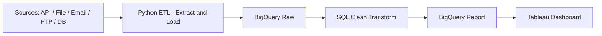

# ETL Python Projects by brwibisono
Repository ini merupakan bagian dari portofolio saya untuk menunjukkan kemampuan ETL (Extract, Transform, Load) menggunakan Python dan integrasi dengan Google BigQuery.

Notes: Akan selalu update sesuai dengan tingkat skill dan materi yang telah dipahami.

## Alat dan Teknologi
* Bahasa Pemrograman: Python (Extract & Load) + SQL (Transform)
* Data Warehouse: Google BigQuery
* Proses & Transformasi Data: BigQuery (SQL, scheduled queries)
* Integrasi Data: API, File (CSV/Excel), Email (IMAP), FTP/SFTP, Traditional Database
* Visualisasi Data: Tableau


## Workflow Pipeline
1. **Extract & Load (Python)**  
   - Mengambil data dari API, file (CSV/Excel), email attachment, FTP/SFTP, atau database tradisional.  
   - Menggunakan Python (`requests`, `pandas`, `google-cloud-bigquery`) untuk memuat data ke **BigQuery Raw Layer**.  

2. **Transform (SQL in BigQuery)**  
   - Membersihkan & mentransformasi data dengan SQL.  
   - Otomatisasi proses menggunakan **scheduled queries** → menghasilkan **BigQuery Clean Layer**.  

3. **Visualization (Tableau)**  
   - Data diolah lebih lanjut untuk membuat dashboard interaktif. 

## Flowchart



## Struktur

```
├── pipeline_data_gempa/ # Extract dari API USGS
├── pipeline_cuaca_polusi/ # Extract dari API Mateo Weather & API Mateo Air Quality
└── README.md
```

## Tableau Public
https://public.tableau.com/app/profile/brwibisono/vizzes

## Portofolio SQL BigQuery
https://github.com/brwibisono/portofolio_data-analyst

## Sertifikat
https://bit.ly/brwibisono_sertifikat

## Daily Update
www.threads.com/@brbelajardata

## Kontak
Untuk pertanyaan atau umpan balik, silakan hubungi saya melalui br.wibisono@gmail.com
