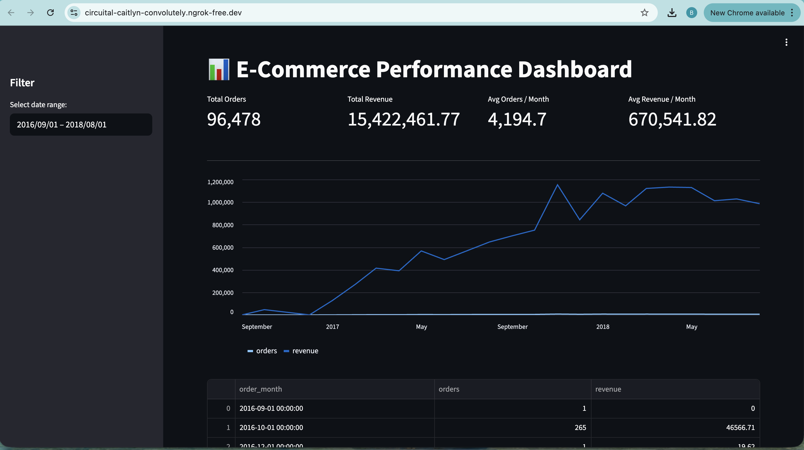

# Proyek Analisis Data – E-Commerce

Proyek ini merupakan bagian dari **Proyek Akhir Analisis Data Dicoding**.
Tujuan dari proyek ini adalah melakukan analisis data e-commerce untuk
menghasilkan insight bisnis serta menyajikannya dalam bentuk dashboard
interaktif menggunakan Streamlit.

---

## 📦 Dataset

Dataset yang digunakan adalah **E-Commerce Public Dataset**, yang terdiri dari:
- Orders
- Order Items
- Payments
- Customers
- Products
- Product Category Translation

Pada tahap persiapan data, nama kategori produk dalam bahasa Portugis
dinormalisasi ke bahasa Inggris menggunakan dataset terjemahan kategori.

---

## 🔄 Alur Analisis Data

Proses analisis dilakukan secara end-to-end dengan tahapan berikut:

1. **Data Gathering**
   - Memuat seluruh dataset CSV ke dalam notebook

2. **Data Wrangling**
   - *Assessing Data*: Pengecekan missing value, nama kategori produk, dan jumlah kategori produk
   - *Cleaning Data*: normalisasi nama kategori produk dan penanganan nilai kosong

3. **Exploratory Data Analysis (EDA)**
   - Analisis tren jumlah pesanan dan pendapatan per bulan
   - Analisis kontribusi kategori produk terhadap pendapatan
   - Analisis perilaku pelanggan menggunakan pendekatan RFM

4. **Visualization & Explanatory Analysis**
   - Menyajikan hasil analisis dalam bentuk visualisasi yang mudah dipahami

5. **Dashboard Development**
   - Menyusun dashboard interaktif menggunakan Streamlit
   - Dataset hasil agregasi (main_data.csv) digunakan sebagai salah satu sumber data utama dashboard

---

## 📊 Dashboard

Dashboard menampilkan informasi berikut:
- Total Orders
- Total Revenue
- Rata-rata Orders per Bulan
- Rata-rata Revenue per Bulan
- Tren bulanan Orders dan Revenue
- Filter rentang waktu

### Dashboard Preview


---

## 🚀 Jalankan Dashboard di Google Colab

1. Install:
   ```bash
   !pip install streamlit pyngrok

2. Konfigurasi:
   ```bash
   !streamlit run /content/dashboard/dashboard.py &>/content/logs.txt &

2. Running:
   ```bash
   from pyngrok import ngrok
    ngrok.set_auth_token("ISI-DENGAN_AUTHTOKEN_PYNGROK")
    public_url = ngrok.connect(8501)
    public_url

---

## 🗂️ Struktur Submission

```
submissions
├── dashboard/
|   ├── dashboard.py
|   ├── main_data.csv
|   └── product_revenue.csv
├── data/                                          
|   ├── customers_dataset.csv
|   ├── order_items_dataset.csv
|   ├── order_payments_dataset.csv
|   ├── orders_dataset.csv
|   ├── product_category_name_translation.csv
|   ├── products_dataset_clean.csv
|   └── products_dataset.csv
├── Proyek_Analisi_Data.ipynb
├── requirements.txt
└── README.md
```

---

## ✍️ Author
**Bramantya Wibisono**

Submission Dicoding - Proyek Analisis Data

📧 **br.wibisono@gmail.com**
