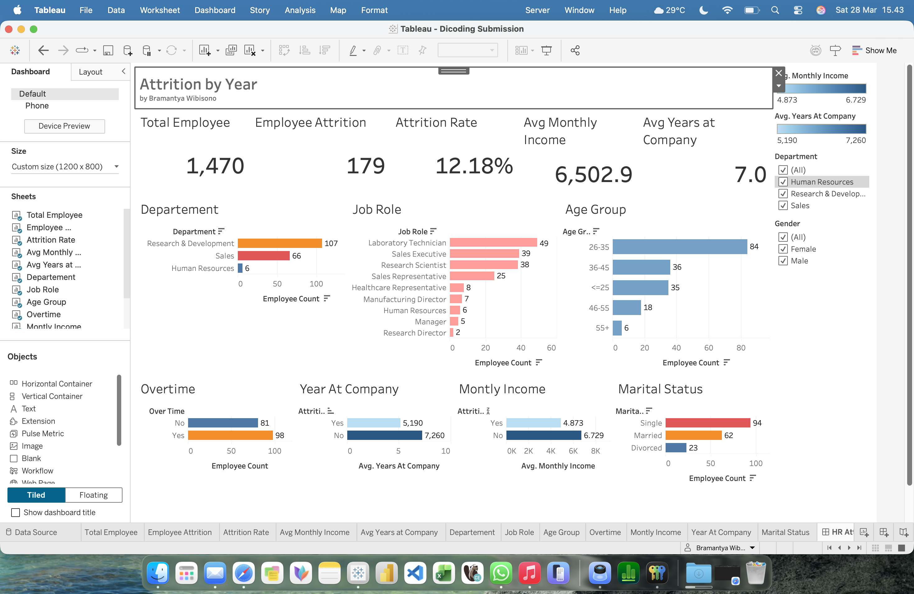

# HR Attrition Analysis Dashboard

Analisis data HR untuk mengidentifikasi pola attrition (employee turnover) dan membangun dashboard interaktif menggunakan Tableau sebagai bagian dari submission proyek visualisasi data / business intelligence.

## 📌 Project Overview

Employee attrition merupakan salah satu indikator penting dalam analisis SDM karena berhubungan langsung dengan stabilitas operasional, biaya rekrutmen, produktivitas tim, dan risiko kehilangan talent.

Pada proyek ini, dilakukan analisis terhadap dataset HR Attrition untuk:
- memahami distribusi attrition,
- mengidentifikasi segmentasi karyawan dengan risiko turnover lebih tinggi,
- serta menyajikan insight dalam bentuk dashboard interaktif menggunakan Tableau.

Output utama proyek ini adalah **dashboard HR Attrition** yang dapat digunakan untuk:
- monitoring tingkat attrition,
- eksplorasi faktor-faktor yang berpotensi berkaitan dengan turnover,
- mendukung pengambilan keputusan berbasis data pada area retensi karyawan.

---

## 🎯 Business Understanding

### Problem Statement
Perusahaan perlu memahami pola employee attrition untuk menjawab pertanyaan berikut:

1. Berapa jumlah total karyawan dan berapa jumlah karyawan yang mengalami attrition?
2. Seberapa besar attrition rate secara keseluruhan?
3. Department atau job role mana yang memiliki attrition lebih tinggi?
4. Apakah terdapat indikasi hubungan antara overtime, income, tenure, dan attrition?
5. Segmentasi demografis apa yang menunjukkan pola turnover yang lebih menonjol?

### Project Objectives
Proyek ini bertujuan untuk:
- membangun dashboard HR yang ringkas, informatif, dan mudah dipahami,
- menyajikan KPI utama terkait workforce dan attrition,
- mengidentifikasi pola attrition berdasarkan struktur organisasi, profil karyawan, dan faktor operasional,
- memberikan dasar insight awal untuk strategi employee retention.

---

## 📂 Dataset

Dataset yang digunakan adalah dataset **employee_data.csv** dengan struktur yang berisi informasi employee profile, compensation, tenure, satisfaction, dan attrition status.

### Beberapa field utama yang digunakan:
- `Attrition`
- `Department`
- `JobRole`
- `AgeGroup`
- `OverTime`
- `MaritalStatus`
- `MonthlyIncome`
- `YearsAtCompany`

### Catatan Data Preparation
Sebelum divisualisasikan di Tableau, dilakukan penyesuaian struktur data agar:
- tipe data terbaca dengan benar,
- field kategorikal dan numerik konsisten,
- file final siap digunakan sebagai flat analytical table.

Selain itu, dibuat field tambahan di Tableau:

- **Employee Count**  
  Calculated field sederhana untuk menghitung jumlah employee per row.

```tableau
1
```
Field ini digunakan sebagai dasar agregasi jumlah karyawan dan attrition count.

## 🛠️ Tools & Technologies
- Google Colab - transform dataset with python
- Tableau — dashboard development & data visualization
- Tableau Public — documentation & portfolio publishing

## 📊 Dashboard Development Approach

Dashboard dirancang dengan pendekatan business-first dan decision-oriented, bukan sekadar visualisasi deskriptif.

KPI Utama

Dashboard menampilkan 5 KPI utama:
1. Total Employees
2. Attrition Count
3. Attrition Rate
4. Average Monthly Income
5. Average Years at Company

Visual Analysis

Visual utama yang dibangun:
1.	Attrition by Department
2.	Attrition by Job Role
3.	Attrition by Age Group
4.	Attrition by Overtime
5.	Average Monthly Income by Attrition
6.	Average Years at Company by Attrition
7.	Attrition by Marital Status

Dashboard Design Principles
- fokus pada insight yang cepat dibaca
- layout ringkas dan recruiter-friendly
- kombinasi KPI + diagnostic charts
- cocok untuk business storytelling dan eksplorasi awal HR risk

## 📈 Key Analytical Focus

Analisis pada dashboard ini dibagi ke dalam 3 lapisan utama:

1. Organizational Structure

Untuk melihat area organisasi yang paling terdampak:
- Department
- Job Role

2. Employee Demographics

Untuk melihat pola berdasarkan segmentasi karyawan:
- Age Group
- Marital Status

3. Behavioral & Economic Signals

Untuk mengamati faktor yang sering berkaitan dengan attrition:
- Overtime
- Monthly Income
- Years at Company

Pendekatan ini membantu memisahkan analisis antara:
- where attrition happens (di mana attrition terjadi),
- who is more exposed (siapa yang lebih berisiko),
- what factors may relate (faktor apa yang berpotensi terkait).

## 🔍 Example Insights

Beberapa insight yang dapat dieksplorasi dari dashboard:
- Department tertentu dapat menunjukkan jumlah attrition yang lebih tinggi dibanding department lain.
- Job role tertentu dapat menjadi prioritas evaluasi retensi.
- Overtime dapat menjadi sinyal penting terhadap potensi turnover.
- Karyawan dengan tenure lebih pendek dapat menunjukkan kecenderungan attrition lebih tinggi.
- Perbedaan rata-rata income antara karyawan yang stay vs attrition dapat menjadi indikasi awal untuk evaluasi kompensasi.

Catatan:
Dashboard ini bersifat descriptive & diagnostic exploratory analysis, sehingga insight yang muncul adalah dasar untuk investigasi lanjutan, bukan kesimpulan kausal final.

## 🌐 Tableau Public Dashboard

Dashboard dapat diakses di sini:

🔗 Tableau Public
[HR Attrition Dashboard](https://public.tableau.com/app/profile/brwibisono/viz/DicodingSubmission/HRAttririonDashboard?publish=yes)

🖼️ Dashboard Preview




🚀 How to Reproduce
1.	Siapkan dataset final dalam format CSV (flat analytical table)
2.	Import dataset ke Tableau
3.	Pastikan tipe data numerik & kategorikal terbaca dengan benar
4.	Buat calculated field:
- Employee Count = 1
5.	Bangun KPI cards:
- Total Employees
- Attrition Count
- Attrition Rate
- Avg Monthly Income
- Avg Years at Company
6.	Buat visual utama:
- Attrition by Department
- Attrition by Job Role
- Attrition by Age Group
- Attrition by Overtime
- Avg Monthly Income by Attrition
- Avg Years at Company by Attrition
- Attrition by Marital Status
7.	Susun ke dalam dashboard final dengan layout business-friendly
8.	Publish ke Tableau Public


## 💡 Business Value

Dashboard ini memberikan value pada beberapa area berikut:
- HR Monitoring
Menyediakan baseline KPI attrition yang mudah dipantau.
- Retention Prioritization
Membantu mengidentifikasi area dengan turnover yang lebih tinggi.
- Operational Awareness
Memberikan sinyal awal terkait workload (overtime), tenure, dan income.
- Portfolio Readiness
Menunjukkan kemampuan membangun dashboard yang relevan secara bisnis, bukan hanya visual semata.

## 🧠 Analyst Notes

Dalam proyek ini, pendekatan yang digunakan berfokus pada:
- data simplification first
memastikan dataset mudah dibaca dan stabil di Tableau, Saya sempat menggunakan CSV namun tidak terbaca sempurna jadi saya beralih pakai TSV
- business storytelling second
memilih visual yang langsung menjawab pertanyaan bisnis,
- dashboard usability third
menyusun layout yang ringkas, clean, dan mudah dipresentasikan.

Pendekatan ini sangat penting dalam project analitik dunia kerja, terutama ketika waktu terbatas dan output harus tetap decision-ready.

## 🗂️ Struktur Submission

```
submissions
├── fact_tableau.tsv          -berisi fact dataset siap analisis tableau
├── dashboard.png             -screenshot dashboard                                         
├── notebook.ipynb
├── requirements.txt
└── README.md
```

## ✍️ Author
**Bramantya Wibisono**

Submission Dicoding - Menyelesaikan Permasalahan Human Resources

📧 **br.wibisono@gmail.com**

