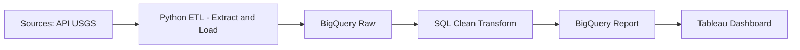
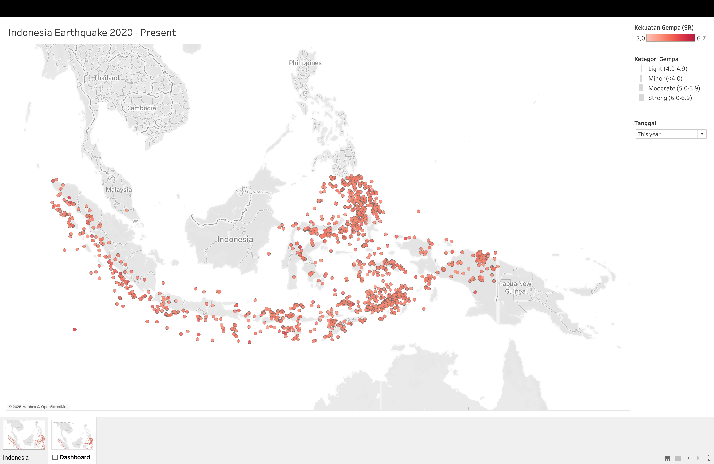

# 🌋 Indonesia Earthquake Data Pipeline (ETL + BigQuery + Tableau)
by brwibisono

### 🇮🇩 Deskripsi Singkat
Proyek ini menganalisis aktivitas gempa bumi di Indonesia menggunakan pipeline otomatis berbasis **USGS API**, **Python**, **Google BigQuery**, dan **Tableau**.  
Pipeline ini dirancang untuk memperbarui data secara berkala, membersihkannya dengan SQL, dan menampilkannya dalam bentuk dashboard interaktif.

### 🇬🇧 Project Description
This project analyzes earthquake activities in Indonesia using an automated pipeline built with **USGS API**, **Python**, **Google BigQuery**, and **Tableau**.  
The pipeline extracts real-time data, cleans it using SQL transformations, and visualizes insights through an interactive dashboard.

---

## ⚙️ Data Pipeline Architecture



---

## 📊 Dashboard Visualization

📸 Tableau Dashboard Screenshot  
> (Ganti link di bawah dengan link Tableau Public milikmu)



🔗 [Lihat Dashboard di Tableau Public](https://public.tableau.com/app/profile/brwibisono/vizzes)

---

## 🧩 1. Extract & Load (Python)

### 🇮🇩 Penjelasan
Script Python ini mengekstrak data gempa dari **USGS API**, melakukan normalisasi menggunakan **pandas**, lalu memuat data ke BigQuery dengan `to_gbq()`.

### 🇬🇧 Explanation
The Python script extracts earthquake data from the **USGS API**, normalizes it using **pandas**, and loads it into BigQuery using `to_gbq()`.

**Snippet (bagian vital):**
```python
import pandas as pd, requests
from google.cloud import bigquery

url = "https://earthquake.usgs.gov/fdsnws/event/1/query?format=geojson"
response = requests.get(url)
data = pd.json_normalize(response.json()['features'])
data.to_gbq(destination_table='brbelajardata.data_gempa_indonesia.raw_data',
            project_id='brbelajardata',
            if_exists='replace')

## 🧮 2. Transform (BigQuery)

### 🇮🇩 Tahapan Transformasi

Proses transformasi dilakukan sepenuhnya dengan SQL di BigQuery melalui tiga tahap:

1. Deduplication – Menghapus data duplikat berdasarkan id

2. Cleaning – Mengonversi tipe data, membuat klasifikasi magnitude dan kedalaman

3. Report View – Menyusun data siap pakai untuk visualisasi Tableau

### 🇬🇧 Transformation Steps

Data transformation is handled entirely in BigQuery SQL in three steps:

1. Deduplication – Remove duplicate entries using ROW_NUMBER()

2. Cleaning – Convert data types and create magnitude/depth classification

3. Report View – Create a Tableau-ready summarized dataset


## 📈 3. Visualization (Tableau)

### 🇮🇩 Penjelasan

Dashboard menampilkan distribusi gempa di Indonesia berdasarkan waktu, kekuatan, dan kedalaman.
Data diperbarui secara otomatis melalui koneksi langsung dari BigQuery.

### 🇬🇧 Description

The Tableau dashboard displays Indonesia’s earthquake distribution by time, magnitude, and depth,
with data updated automatically from BigQuery.


## 🧠 Key Insights

###🇮🇩 Temuan Utama

- Aktivitas gempa tertinggi terjadi di wilayah Timur Indonesia

- Sebagian besar gempa tergolong dangkal (<70 km)

- Pipeline otomatis memperbarui data setiap hari tanpa input manual

### 🇬🇧 Key Findings

- The highest earthquake activity occurs in Eastern Indonesia

- Most earthquakes are shallow (<70 km)

- The automated pipeline updates daily with no manual intervention


## 🧰 Tools & Technologies

- Stage: Tools & Libraries
- Extract & Load: Python (`requests`, `pandas`, `google-cloud-bigquery`)
- Transform: BigQuery SQL
- Visualization: Tableau
- Source Data: USGS Earthquake API

## Structure

```
pipeline_data_gempa/
│
├── src/
│   └── python_etl_snippet.py      ← contoh script ETL singkat
│
├── sql/
│   ├── 2_dedup.sql
│   ├── 3_clean.sql
│   └── 4_report.sql
│
├── screenshot/
│   └── tableau_dashboard.png      ← hasil visual Tableau
│
├── README.md                      ← dokumentasi bilingual
│
└── .gitignore                     ← keamanan + kebersihan repo
```


## 👤 About Me

### 🇮🇩 Tentang Saya

Saya BR Wibisono (brbelajardata), seorang Data Analyst yang sedang mendalami Data Engineering Pipeline.
Fokus saya adalah membangun pipeline ETL otomatis yang efisien dan mudah diintegrasikan dengan dashboard analitik.

### 🇬🇧 About Me

I'm BR Wibisono (brbelajardata) — a Data Analyst exploring Data Engineering Pipelines.
My focus is building automated ETL systems that connect seamlessly to analytical dashboards.

## Email: br.wibisono@gmail.com

## Tableau Public
https://public.tableau.com/app/profile/brwibisono/vizzes

## Social Media (Threads)
www.threads.com/@brbelajardata

## Certification
https://bit.ly/brwibisono_sertifikat


