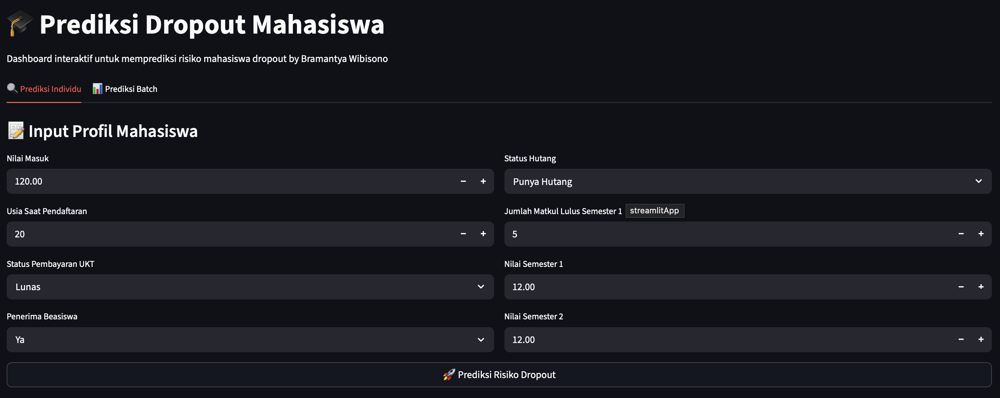
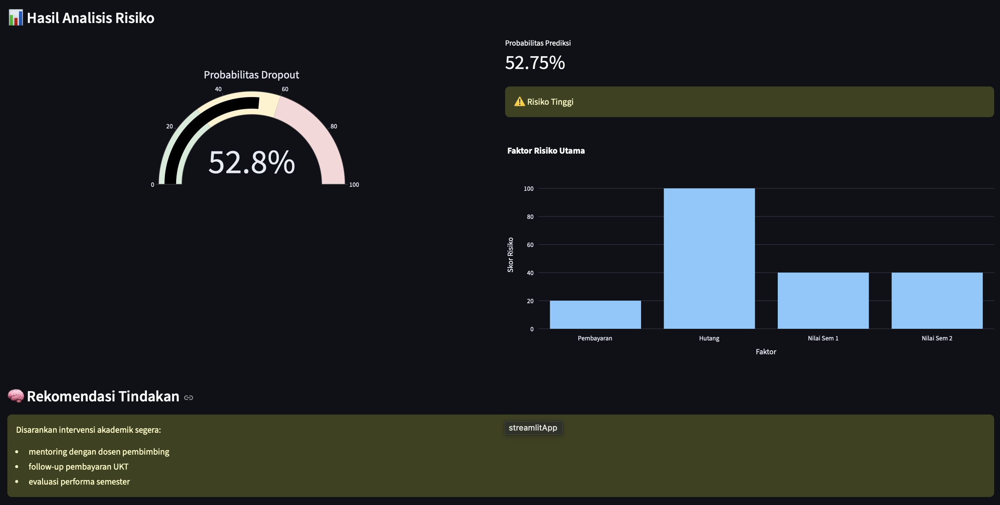
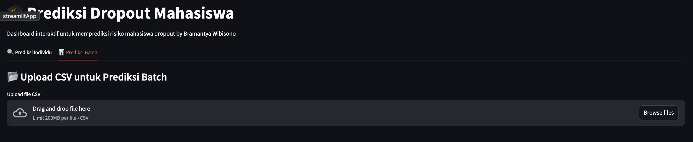
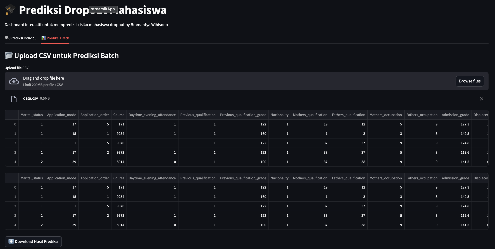

# Proyek Akhir: Prediksi Dropout Mahasiswa (Edutech Analytics)

---

## Business Understanding

Jaya Jaya Institut merupakan institusi pendidikan tinggi yang telah berdiri sejak tahun 2000 dan memiliki reputasi lulusan yang baik. Namun, institusi ini menghadapi tantangan serius berupa tingginya jumlah mahasiswa yang tidak menyelesaikan pendidikan (dropout).

Dropout tidak hanya berdampak pada reputasi institusi, tetapi juga berpengaruh terhadap efisiensi operasional, perencanaan akademik, serta potensi kehilangan pendapatan.

Oleh karena itu, diperlukan pendekatan berbasis data untuk:
- mendeteksi risiko dropout lebih dini,
- memahami faktor-faktor yang berkontribusi terhadap dropout,
- serta mendukung intervensi akademik yang lebih tepat.

## Permasalahan Bisnis

Beberapa pertanyaan utama yang ingin dijawab:

1. Mahasiswa seperti apa yang memiliki risiko dropout lebih tinggi?
2. Faktor apa yang paling berkaitan dengan risiko dropout?
3. Bagaimana institusi dapat mengidentifikasi mahasiswa berisiko secara cepat dan scalable?
4. Bagaimana menyajikan informasi tersebut dalam bentuk yang mudah dipahami oleh stakeholder?

## Cakupan Proyek

Proyek ini mencakup 3 komponen utama:

1. **Exploratory Data Analysis (EDA)**
   - memahami pola data mahasiswa
   - mengidentifikasi distribusi dan hubungan antar variabel

2. **Machine Learning Model**
   - membangun model klasifikasi untuk prediksi dropout
   - menghasilkan probabilitas risiko dropout

3. **Dashboard & Prototype System**
   - dashboard Tableau untuk monitoring
   - aplikasi Streamlit untuk prediksi interaktif

### Persiapan

## Sumber Data
Dataset: Dataset Student's Performance [data.csv](https://github.com/dicodingacademy/dicoding_dataset/blob/main/students_performance/data.csv)
Berisi informasi:
- profil mahasiswa
- status finansial
- performa akademik
- status akhir (dropout / graduate)

---

### Setup Environment
Proyek ini dikembangkan menggunakan kombinasi Python (untuk data preparation & machine learning), Tableau (untuk dashboard), dan Streamlit (untuk prototype sistem prediksi).

## 1. Tools & Environment

Proyek ini dijalankan menggunakan:

- **Python 3.12.13** (Google Colab environment)
- **Google Colab** untuk data processing & modelling
- **Pandas & NumPy** untuk data manipulation
- **Scikit-learn** untuk machine learning
- **Plotly & Matplotlib** untuk visualisasi
- **Streamlit** untuk prototype aplikasi prediksi
- **Tableau Public** untuk dashboard bisnis

## 2. Struktur File Project

Pastikan struktur project seperti berikut:

```
submission
├── model/
|   ├── student_dropout_model.pkl
|   └── model_features.pkl
├── media/
|   ├── <brwibisono>.dashboard.png
|   ├── <brwibisono>.ml_1.png
|   ├── <brwibisono>.ml_2.png
|   ├── <brwibisono>.ml_3.png
|   └── <brwibisono>.ml_4.png
├── app.py/                                          
├── notebook.ipynb
├── requirements.txt
├── fact_student.tsv
└── Readme.md
```

## 3. Menjalankan Notebook (Data Preparation & Modeling)

1. Pastikan file berikut tersedia dalam satu folder project:
   - `model (folder)`
   - `media (folder)`
   - `app.py`
   - `notebook.ipynb`
   - `fact_student.tsv`
   - `requirements.txt`
   - `README.md`

2. Buka file `notebook.ipynb` di:
   - Google Colab (recommended)

3. Upload dataset Student's Performance [data.csv](https://github.com/dicodingacademy/dicoding_dataset/blob/main/students_performance/data.csv) jika diperlukan / diminta

4. Jalankan seluruh cell secara berurutan:

   - **Library**
   - **Data Understanding & EDA**
   - **Data Cleaning & Transformation / Feature Enginering**
   - **Model Training**
   - **Evaluation**

5. Setelah selesai, akan dihasilkan file:
   - `fact_student.tsv (untuk dashboard tableau)`
   - `student_dropout_model.pkl`
   - `model_features.pkl`


File `.pkl` ini akan digunakan oleh aplikasi Streamlit.

## 4. Menjalankan Aplikasi Streamlit (Local)

1. Aktifkan virtual environment (opsional tapi direkomendasikan):

```bash
source venv/bin/activate
```

2. Install Library
```bash
pip install -r requirements.txt
```

2. Jalankan Aplikasi
```bash
streamlit run app.py
```
Saya memakai mac, bisa jadi setup windows berbeda.

## 5. Deployment (Streamlit Cloud)

Aplikasi juga dapat dijalankan secara online melalui Streamlit Community Cloud:

Langkah deployment:

1. Upload project ke GitHub repository
2. Pastikan file berikut tersedia:
  - app.py
  - requirements.txt
  - folder model/
    
3. Deploy melalui:
   https://share.streamlit.io

4. Set Main file path sesuai struktur repo
5. Untuk hasil deploy project ini cek disini [Student's Dropout by brwibisono](https://brwibisono.streamlit.app)

## 6. Dashboard (Tableau Public)

1. Load file `.tsv` ke tableau desktop
2. Build sheet sesuai kebutuhan
3. Combine sheet ke dalam dashboard
4. Buat filter
5. Unggah ke Tableau Public

⚠️ Catatan Penting
- Path model harus sesuai dengan struktur repository di Github `(misal repo github saya : student_dropout/model/...)`
- File `.pkl` harus benar-benar ter-upload ke GitHub (bukan empty file)
- Format dataset untuk Tableau menggunakan `.tsv` agar lebih stabil

---

### Business Dashboard

Dashboard dapat diakses di sini:

🔗 Tableau Public
[Student's Dropout Dasboard](https://public.tableau.com/app/profile/brwibisono/viz/)

🖼️ Dashboard Preview


---

### Menjalankan Sistem Machine Learning

## Buka link [Student's Dropout by brwibisono](https://brwibisono.streamlit.app) berikut

1. Pada page pertama jika ingin `prediksi individual` akan menampilkan seperti ini:


2. Setelah di isi dan klik 🚀 Resiko Prediksi Dropout, akan menghasilkan seperti ini:


3. Untuk page kedua jika ingin `prediksi batch (banyak data)` akan menampilkan seperti ini:


4. Setelah upload file `.csv` disini saya pakai contoh file [data.csv](https://github.com/dicodingacademy/dicoding_dataset/blob/main/students_performance/data.csv), akan menghasilkan:


Dan hasil dari data prediksi ke 4 dapat di download berupa file `.csv`

---

### Conclusion

## rekomendasi action items

   

