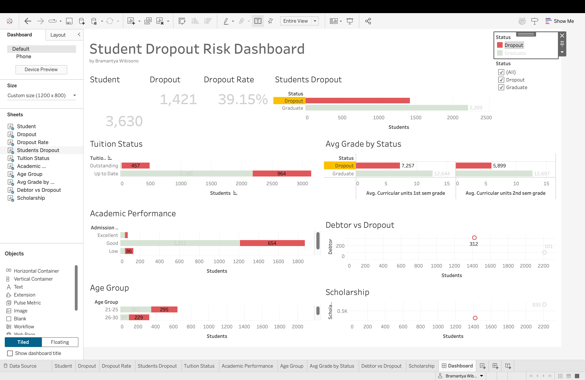
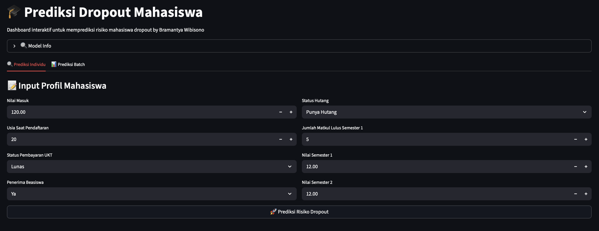
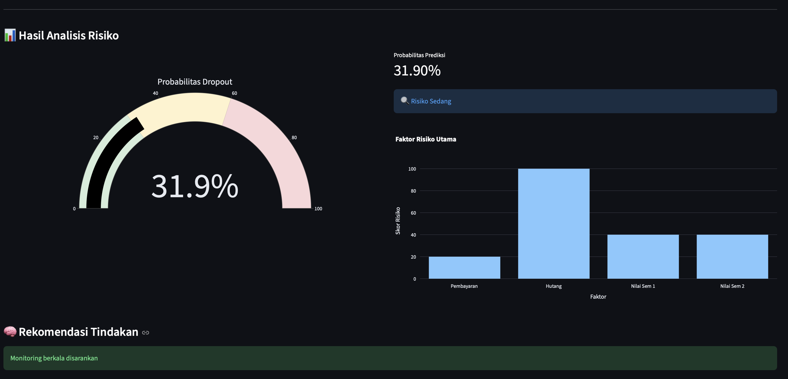
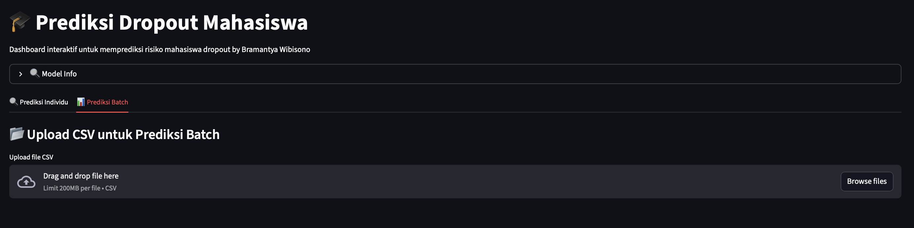
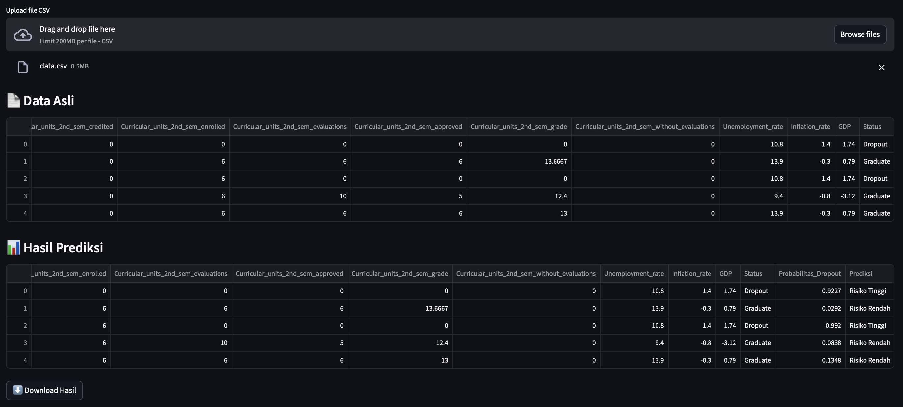

# Proyek Akhir: Prediksi Dropout Mahasiswa (Edutech Analytics)

---

## Business Understanding

Jaya Jaya Institut merupakan institusi pendidikan tinggi yang telah berdiri sejak tahun 2000 dan memiliki reputasi lulusan yang baik. Namun, institusi ini menghadapi tantangan serius berupa tingginya jumlah mahasiswa yang tidak menyelesaikan pendidikan (dropout).

Dropout tidak hanya berdampak pada reputasi institusi, tetapi juga berpengaruh terhadap efisiensi operasional, perencanaan akademik, serta potensi kehilangan pendapatan.

Oleh karena itu, diperlukan pendekatan berbasis data untuk:
- mendeteksi risiko dropout lebih dini,
- memahami faktor-faktor yang berkontribusi terhadap dropout,
- serta mendukung intervensi akademik yang lebih tepat.

## Permasalahan Bisnis

Beberapa pertanyaan utama yang ingin dijawab:

1. Mahasiswa seperti apa yang memiliki risiko dropout lebih tinggi?
2. Faktor apa yang paling berkaitan dengan risiko dropout?
3. Bagaimana institusi dapat mengidentifikasi mahasiswa berisiko secara cepat dan scalable?
4. Bagaimana menyajikan informasi tersebut dalam bentuk yang mudah dipahami oleh stakeholder?

## Cakupan Proyek

Proyek ini mencakup 3 komponen utama:

1. **Exploratory Data Analysis (EDA)**
   - memahami pola data mahasiswa
   - mengidentifikasi distribusi dan hubungan antar variabel

2. **Machine Learning Model**
   - membangun model klasifikasi untuk prediksi dropout
   - menghasilkan probabilitas risiko dropout

3. **Dashboard & Prototype System**
   - dashboard Tableau untuk monitoring
   - aplikasi Streamlit untuk prediksi interaktif

### Persiapan

## Sumber Data
Dataset: Dataset Student's Performance [data.csv](https://github.com/dicodingacademy/dicoding_dataset/blob/main/students_performance/data.csv)
Berisi informasi:
- profil mahasiswa
- status finansial
- performa akademik
- status akhir (dropout / graduate)

---

### Setup Environment
Proyek ini dikembangkan menggunakan kombinasi Python (untuk data preparation & machine learning), Tableau (untuk dashboard), dan Streamlit (untuk prototype sistem prediksi).

## 1. Tools & Environment

Proyek ini dijalankan menggunakan:

- **Python 3.12.13** (Google Colab environment)
- **Google Colab** untuk data processing & modelling
- **Pandas & NumPy** untuk data manipulation
- **Scikit-learn** untuk machine learning
- **Plotly & Matplotlib** untuk visualisasi
- **Streamlit** untuk prototype aplikasi prediksi
- **Tableau Public** untuk dashboard bisnis

## 2. Struktur File Project

Pastikan struktur project seperti berikut:

```
submission
├── model/
|   ├── student_dropout_model.pkl
|   └── model_features.pkl
├── <brwibisono>-dashboard.png
├── <brwibisono>-ml_1.png
├── <brwibisono>-ml_2.png
├── <brwibisono>-ml_3.png
├── <brwibisono>-ml_4.png
├── <brwibisono>-video.mov
├── app.py/                                          
├── notebook.ipynb
├── requirements.txt
├── fact_student.tsv
└── Readme.md
```

## 3. Menjalankan Notebook (Data Preparation & Modeling)

1. Pastikan file berikut tersedia dalam satu folder project:
   - `model (folder)`
   - `app.py`
   - `notebook.ipynb`
   - `fact_student.tsv`
   - `requirements.txt`
   - `<brwibisono>-dashboard.png`
   - `<brwibisono>-ml_1.png`
   - `<brwibisono>-ml_2.png`
   - `<brwibisono>-ml_3.png`
   - `<brwibisono>-ml_4.png`
   - `<brwibisono>-video.png`
   - `README.md`

2. Buka file `notebook.ipynb` di:
   - Google Colab (recommended)

3. Upload dataset Student's Performance [data.csv](https://github.com/dicodingacademy/dicoding_dataset/blob/main/students_performance/data.csv) jika diperlukan / diminta

4. Jalankan seluruh cell secara berurutan:

   - **Library**
   - **Data Understanding & EDA**
   - **Data Cleaning & Transformation / Feature Enginering**
   - **Model Training**
   - **Evaluation**

5. Setelah selesai, akan dihasilkan file:
   - `fact_student.tsv (untuk dashboard tableau)`
   - `student_dropout_model.pkl`
   - `model_features.pkl`


File `.pkl` ini akan digunakan oleh aplikasi Streamlit.

## 4. Menjalankan Aplikasi Streamlit (Local)

1. Aktifkan virtual environment (opsional tapi direkomendasikan):

```bash
source venv/bin/activate
```

2. Install Library
```bash
pip install -r requirements.txt
```

2. Jalankan Aplikasi
```bash
streamlit run app.py
```
Saya memakai mac, bisa jadi setup windows berbeda.

## 5. Deployment (Streamlit Cloud)

Aplikasi juga dapat dijalankan secara online melalui Streamlit Community Cloud:

Langkah deployment:

1. Upload project ke GitHub repository
2. Pastikan file berikut tersedia:
  - app.py
  - requirements.txt
  - folder model/
    
3. Deploy melalui:
   https://share.streamlit.io

4. Set Main file path sesuai struktur repo
5. Untuk hasil deploy project ini cek disini [Student's Dropout by brwibisono](https://brwibisono.streamlit.app)

## 6. Dashboard (Tableau Public)

1. Load file `.tsv` ke tableau desktop
2. Build sheet sesuai kebutuhan
3. Combine sheet ke dalam dashboard
4. Buat filter
5. Unggah ke Tableau Public

⚠️ Catatan Penting
- Path model harus sesuai dengan struktur repository di Github `(misal repo github saya : student_dropout/model/...)`
- File `.pkl` harus benar-benar ter-upload ke GitHub (bukan empty file)
- Format dataset untuk Tableau menggunakan `.tsv` agar lebih stabil

---

### Business Dashboard: Student Dropout Risk Monitoring

Dashboard ini dirancang untuk membantu institusi pendidikan dalam memonitor dan memahami risiko dropout mahasiswa secara menyeluruh, berbasis data akademik, finansial, dan profil mahasiswa.

Dashboard menggunakan pendekatan **descriptive & diagnostic analytics**, sehingga tidak hanya menampilkan kondisi saat ini, tetapi juga membantu mengidentifikasi faktor penyebab utama dropout.


## 1. Ringkasan Utama (KPI)

Pada bagian atas dashboard ditampilkan metrik utama:

- **Total Mahasiswa**: 3,630 Mahasiswa
- **Jumlah Dropout**: 1,421 Mahasiswa
- **Dropout Rate**: 39.15%

Insight utama:
- Tingkat dropout tergolong cukup tinggi (>30%)
- Menunjukkan adanya kebutuhan intervensi akademik dan finansial


## 2. Distribusi Status Mahasiswa

Visualisasi "Students Dropout" menunjukkan distribusi:

- Graduate (mayoritas)
- Dropout
- Enrolled

Insight:
- Walaupun mayoritas lulus, proporsi dropout masih signifikan
- Perlu fokus pada segment mahasiswa berisiko


## 3. Analisis Status Pembayaran (Tuition Status)

Visualisasi menunjukkan hubungan antara:

- Status pembayaran (Up to Date vs Outstanding)
- Status mahasiswa (Dropout / Graduate / Enrolled)

Insight utama:
- Mahasiswa dengan **pembayaran tidak lancar (Outstanding)** memiliki proporsi dropout lebih tinggi
- Faktor finansial merupakan indikator kuat risiko dropout


## 4. Academic Performance Analysis

Bagian ini menganalisis:

- Admission grade (Low, Good, Excellent)
- Rata-rata nilai semester 1 dan 2

Insight utama:
- Mahasiswa dengan admission grade rendah memiliki risiko dropout lebih tinggi
- Rata-rata nilai mahasiswa dropout lebih rendah dibanding graduate
- Performa akademik awal (semester 1) menjadi indikator penting


## 5. Age Group Analysis

Distribusi mahasiswa berdasarkan usia:

- 21–25 tahun
- 26–30 tahun

Insight:
- Kelompok usia tertentu menunjukkan variasi risiko dropout
- Dapat digunakan untuk segmentasi intervensi


## 6. Debtor vs Dropout

Analisis hubungan antara:

- Status hutang mahasiswa
- Jumlah dropout

Insight:
- Mahasiswa dengan status debtor cenderung memiliki risiko dropout lebih tinggi
- Kombinasi faktor finansial + akademik meningkatkan risiko


## 7. Scholarship Analysis

Analisis perbandingan:

- Mahasiswa penerima beasiswa
- Non-penerima

Insight:
- Beasiswa berpotensi menjadi faktor protektif terhadap dropout
- Mahasiswa tanpa dukungan finansial lebih rentan

---

## Key Business Insights

Dari keseluruhan dashboard, terdapat beberapa insight utama:

1. **Faktor finansial adalah driver utama dropout**
   - Status pembayaran dan hutang sangat berpengaruh

2. **Performa akademik awal sangat krusial**
   - Nilai semester 1 menjadi indikator kuat

3. **Dropout bukan hanya masalah akademik**
   - Kombinasi faktor finansial + performa

---

## Business Recommendation

Berdasarkan analisis dashboard:

 - Prioritaskan monitoring mahasiswa dengan:
 - Nilai rendah di semester awal
 - Status pembayaran bermasalah
 - Tingkatkan program bantuan finansial / beasiswa
 - Implementasikan sistem early warning berbasis data
 - Lakukan intervensi akademik sejak semester pertama

---

## Value untuk Institusi

Dashboard ini membantu:

- Mengidentifikasi mahasiswa berisiko lebih cepat
- Mendukung pengambilan keputusan berbasis data
- Meningkatkan retention rate mahasiswa
- Mengoptimalkan strategi akademik dan finansial

Dashboard dapat diakses di sini:

🔗 Tableau Public
[Student's Dropout Dasboard](https://public.tableau.com/app/profile/brwibisono/viz/StudentDropoutRisk/Dashboard?publish=yes)

🖼️ Dashboard Preview



---

### Menjalankan Sistem Machine Learning

## Buka link [Student's Dropout by brwibisono](https://brwibisono.streamlit.app) berikut

1. Pada page pertama jika ingin `prediksi individual` akan menampilkan seperti ini:


2. Setelah di isi dan klik 🚀 Resiko Prediksi Dropout, akan menghasilkan seperti ini:


3. Untuk page kedua jika ingin `prediksi batch (banyak data)` akan menampilkan seperti ini:


4. Setelah upload file `.csv` disini saya pakai contoh file [data.csv](https://github.com/dicodingacademy/dicoding_dataset/blob/main/students_performance/data.csv), akan menghasilkan:


Dan hasil dari data prediksi ke 4 dapat di download berupa file `.csv`

---

### Conclusion

Berdasarkan hasil analisis dan pengembangan model machine learning, kesimpulan pada proyek ini dibagi menjadi dua bagian utama:

---

### 1. Kesimpulan Analisis Data (EDA & Dashboard)

Berdasarkan eksplorasi data dan visualisasi dashboard, risiko dropout mahasiswa di Jaya Jaya Institut dipengaruhi oleh kombinasi faktor akademik dan finansial.

**Faktor utama yang berkaitan dengan dropout:**

- **Performa akademik awal**
  - Nilai semester 1 dan 2 menjadi indikator paling kuat
  - Mahasiswa dengan nilai rendah memiliki risiko dropout lebih tinggi

- **Status pembayaran (tuition fees)**
  - Mahasiswa dengan pembayaran tidak lancar cenderung memiliki risiko lebih tinggi

- **Status hutang (debtor)**
  - Mahasiswa yang memiliki hutang menunjukkan kecenderungan dropout lebih besar

- **Beasiswa (scholarship)**
  - Beasiswa berperan sebagai faktor protektif terhadap dropout

Insight ini menunjukkan bahwa dropout bukan hanya dipengaruhi oleh faktor akademik, tetapi juga sangat dipengaruhi oleh kondisi finansial mahasiswa.

---

### 2. Kesimpulan Model Machine Learning

Model yang digunakan dalam proyek ini adalah **Random Forest Classifier** yang dilatih untuk memprediksi probabilitas mahasiswa mengalami dropout.

**Performa model:**
- Accuracy  : 88.98%
- Precision : 88.64%
- Recall    : 82.39%
- F1-score  : 85.40%

Model ini mampu mengidentifikasi pola risiko dropout dengan cukup baik dan dapat digunakan sebagai sistem prediksi awal (early warning system).

**Fitur yang digunakan dalam model (8 fitur utama):**
- Admission_grade  
- Age_at_enrollment  
- Tuition_fees_up_to_date  
- Scholarship_holder  
- Debtor  
- Curricular_units_1st_sem_approved  
- Curricular_units_1st_sem_grade  
- Curricular_units_2nd_sem_grade  

**Fitur yang paling berpengaruh terhadap prediksi (berdasarkan domain & model behavior):**
- Performa akademik semester 1 dan 2
- Status pembayaran UKT
- Status hutang mahasiswa

---

### Ringkasan

Dengan menggabungkan:
- analisis data (EDA),
- dashboard monitoring,
- serta model machine learning,

institusi kini memiliki pendekatan berbasis data untuk:
- mendeteksi mahasiswa berisiko sejak dini,
- memahami faktor penyebab utama dropout,
- serta mendukung pengambilan keputusan yang lebih tepat dan terukur.

Model yang dibangun juga telah disesuaikan dengan aplikasi Streamlit menggunakan fitur yang konsisten antara tahap training dan deployment, sehingga hasil prediksi lebih valid dan dapat digunakan secara praktis.


## Rekomendasi Action Items

Berdasarkan hasil analisis dan model prediksi, berikut beberapa rekomendasi strategis yang dapat diterapkan oleh institusi:

---

### 1. Implementasi Early Warning System

Gunakan model machine learning sebagai sistem deteksi dini untuk:

- mengidentifikasi mahasiswa dengan risiko dropout tinggi sejak awal semester
- memprioritaskan mahasiswa yang membutuhkan intervensi

➡️ Implementasi:
- integrasikan model ke sistem akademik
- monitoring rutin (mingguan/bulanan)

---

### 2. Intervensi Akademik di Semester Awal

Performa semester 1 terbukti menjadi indikator kuat dropout.

➡️ Action:
- program mentoring / tutoring untuk mahasiswa dengan nilai rendah
- evaluasi berkala performa akademik
- kelas remedial lebih awal

---

### 3. Monitoring dan Dukungan Finansial

Faktor finansial (tuition & debtor) memiliki pengaruh signifikan.

➡️ Action:
- sistem alert untuk mahasiswa dengan pembayaran bermasalah
- opsi cicilan atau restrukturisasi pembayaran
- perluasan program beasiswa / bantuan

---

### 4. Segmentasi Mahasiswa Berisiko

Tidak semua mahasiswa perlu diperlakukan sama.

➡️ Action:
- segmentasi berdasarkan:
  - performa akademik
  - status finansial
  - usia / profil
- buat strategi intervensi yang lebih targeted

---

### 5. Dashboard Monitoring untuk Stakeholder

Gunakan dashboard sebagai alat monitoring rutin.

➡️ Action:
- digunakan oleh:
  - akademik
  - keuangan
  - manajemen
- review performa mahasiswa secara periodik
- gunakan data untuk decision-making

---

### 6. Continuous Model Improvement

Model perlu terus diperbarui agar tetap relevan.

➡️ Action:
- retrain model setiap periode (semester/tahun)
- tambahkan variabel baru jika tersedia
- evaluasi performa model secara berkala

---

## Expected Impact

Dengan implementasi rekomendasi di atas, institusi dapat:

- meningkatkan tingkat kelulusan mahasiswa
- mengurangi angka dropout secara signifikan
- mengoptimalkan intervensi akademik dan finansial
- mengambil keputusan berbasis data, bukan asumsi

---

## ✍️ Author
**Bramantya Wibisono**

Submission Akhir: Menyelesaikan Permasalahan Institusi Pendidikan

📧 **br.wibisono@gmail.com**


